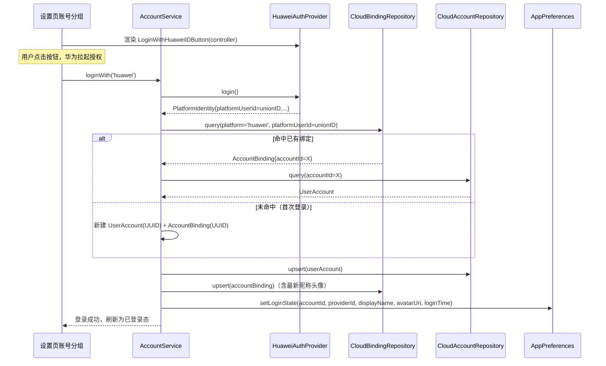
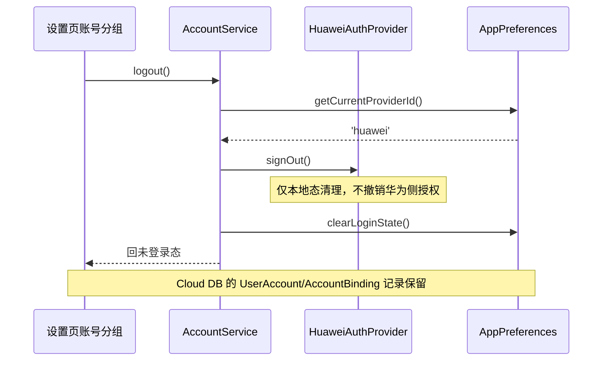

# Design: 华为账号授权登录 + Cloud DB 持久化 + 退出登录

## Context

设置页「账号」分组当前是「已登录」占位 UI，没有真实账号体系。本变更接入首个认证平台——华为账号（`LoginWithHuaweiIDButton`），拿 `unionID` 作为跨应用统一用户标识，通过云数据库（Cloud DB）持久化账号与平台绑定关系，并接通退出登录。架构与数据模型从一开始即为多平台扩展设计：一个 App 账号可绑定多个平台身份（华为、未来微信等），登录入口可插拔。

动机、外部行为、验收标准见 `proposal.md` 与 `specs/huawei-account-login/spec.md`。本文件聚焦「如何实现」。

## Goals / Non-Goals

### Goals
- 用 `LoginWithHuaweiIDButton`（系统组件，用户明确指定）触发华为账号授权，客户端直取 `unionID`
- 设计可插拔 `AuthProvider` 抽象 + 一账号多绑定数据模型，为后续接入微信等平台铺路
- 通过 Cloud DB 持久化 `UserAccount` + `AccountBinding`（首发仅华为 provider，抽象就位）
- 接通退出登录，形成 未登录→登录→已登录→退出→未登录 完整闭环
- 复用现有「已登录」占位 UI，不重新设计视觉

### Non-Goals
- 不自建后端做 `authorizationCode`→`accessToken` 换换（TV 端无后端）
- 不实现「绑定第二个平台」「解绑」UI（架构预留，待第二个 provider 出现再做）
- 不做会员权益、跨端同步等业务能力（仅打地基）
- 不强制登录：未登录也能用 App 核心功能
- 不在退出登录时调用 `CancelAuthorizationRequest` 撤销授权（保留授权便于快速再登录）

## Decisions

### 1. 登录入口：`LoginWithHuaweiIDButton` 系统组件

用户明确指定使用 `LoginWithHuaweiIDButton`。该组件是 HarmonyOS 系统 ArkUI 组件（`@kit.AccountKit` → `@hms.core.account.LoginComponent`），渲染华为官方登录按钮，点击后拉起华为账号授权。

**组件 API（SDK 实测）**：
```typescript
import { LoginWithHuaweiIDButton, loginComponentManager } from '@kit.AccountKit'

// 组件使用
LoginWithHuaweiIDButton({
  params: { style: loginComponentManager.Style.BUTTON_RED, borderRadius: 24, supportDarkMode: true },
  controller: this.buttonController
})

// 拿登录结果（通过 controller 回调，非 onLoginSuccess 属性）
this.buttonController.onClickLoginWithHuaweiIDButton((err, credential) => {
  if (err) { /* 失败处理 */ return }
  // credential: loginComponentManager.HuaweiIDCredential
  //   .unionID: string          ✅ 主键标识
  //   .openID: string
  //   .authorizationCode: string
  //   .idToken?: string         (JWT，可能含 name/picture claims)
})
```

**关键 API 事实**：`HuaweiIDCredential` 直接返回 `unionID`、`openID`、`authorizationCode`、`idToken?`，但**不直接返回 nickname/avatar**。昵称头像需要：
- 方案 A（本次采用，轻量）：尝试解码 `idToken`（JWT）的 payload claims，若含 `name`/`picture` 则取用，否则 `displayName`/`avatarUri` 留空
- 方案 B（未来增强，本次不做）：登录成功后额外调 `authentication.HuaweiIDProvider.createAuthorizationWithHuaweiIDRequest()` 申请 profile scope，返回 `AuthorizationWithHuaweiIDCredential`（含 `nickname`、`avatarUri`）——但会触发二次授权弹窗，损害首登体验

> 因此 `UserAccount.displayName` / `avatarUri` / `AccountBinding.platformDisplayName` / `platformAvatarUri` 均设计为**可选字段**，首登可能为空，后续增强时回填。

### 2. AuthProvider 可插拔抽象

```typescript
// services/account/AuthProvider.ets
export interface PlatformIdentity {
  platformUserId: string      // 华为=unionID；微信=unionid
  displayName: string        // 可为空字符串
  avatarUri: string          // 可为空字符串
  openID: string             // 平台内应用级 ID（华为有，其他平台可选）
  raw: Map<string, string>   // 原始字段兜底（authorizationCode 等）
}

export interface AuthProvider {
  providerId: string         // 'huawei' | 'wechat' ...
  displayName: string        // '华为账号' | '微信' ...
  login(): Promise<PlatformIdentity>
  signOut(): Promise<void>
}
```

**为什么 provider 自带按钮 Builder**：`LoginWithHuaweiIDButton` 是系统 ArkUI struct，无法泛化为统一签名；各平台登录入口 UI 形态各异（微信 SDK 自定义按钮、华为系统按钮）。因此 `AuthProvider` 不约束按钮渲染，由各 provider 提供自己的 `@Builder` 供 UI 调用。本次仅华为 provider 实现 `huaweiLoginButtonBuilder`。

### 3. HuaweiAuthProvider 实现

```typescript
// services/account/providers/HuaweiAuthProvider.ets
export class HuaweiAuthProvider implements AuthProvider {
  providerId = 'huawei'
  displayName = '华为账号'

  async login(): Promise<PlatformIdentity> {
    // 通过 LoginWithHuaweiIDButtonController 拿 HuaweiIDCredential
    // （按钮 UI 由 Builder 渲染，登录结果通过 controller 回调获取，
    //  provider 内部用 Promise 封装回调，等待用户点击按钮后的授权结果）
    // 成功：映射 unionID→platformUserId, openID, 解码 idToken 取 name/picture
    // 失败/取消：抛 BusinessError（1001502012 = 用户取消）
  }

  async signOut(): Promise<void> {
    // 不调用 CancelAuthorizationRequest（避免撤销授权导致下次需重新同意）
    // 仅本地清登录态（由 AccountService 负责）
    // 华为侧无显式 signOut API，保留授权态便于快速再登录
  }
}
```

**Provider 与按钮的关系**：`LoginWithHuaweiIDButton` 是声明式 UI 组件，授权结果通过 `controller.onClickLoginWithHuaweiIDButton` 回调。`HuaweiAuthProvider.login()` 需要与 UI 协作——provider 持有 controller，UI 渲染按钮时引用 provider 的 controller，用户点击后 provider 的 login() Promise 被 resolve。具体：provider 内部维护一个 `pendingResolve` 回调，`login()` 调用时注册 controller 回调并返回 Promise，回调触发后 resolve 或 reject。

### 4. 数据模型：Cloud DB 两表（一账号多绑定）

```
┌─────────────────────────────────┐     ┌──────────────────────────────────┐
│ UserAccount                     │     │ AccountBinding                    │
│ (账号主体，一个用户一条)         │ 1─┬─n│ (平台绑定，一个账号可多条)         │
├─────────────────────────────────┤   │ ├──────────────────────────────────┤
│ accountId: String (PK)          │◄──┘ │ bindingId: String (PK)            │
│ displayName: String             │      │ accountId: String (index)        │
│ avatarUri: String                │      │ platform: String (index)         │
│ createdAt: Date                  │      │ platformUserId: String (index)   │
│ updatedAt: Date                  │      │ platformDisplayName: String      │
└─────────────────────────────────┘      │ platformAvatarUri: String        │
                                         │ boundAt: Date                     │
                                         │ updatedAt: Date                   │
                                         └──────────────────────────────────┘
```

**唯一约束**：`(platform, platformUserId)` 全局唯一——同一华为 unionID 在全 App 只能绑定到一个 `UserAccount`。Cloud DB 不支持复合唯一索引，由代码层保证：`AccountService.loginWith` 先 `query` 再 `upsert`（见时序图）。并发冲突时以先到为准，后到者命中已有 binding。

**Cloud DB 对象类型定义（ArkTS）**：
```typescript
// db/models/UserAccount.ets
export class UserAccount extends cloudDatabase.DatabaseObject {
  accountId: string = ''
  displayName: string = ''
  avatarUri: string = ''
  createdAt: Date = new Date()
  updatedAt: Date = new Date()
  naturalbase_ClassName(): string { return 'UserAccount' }
}

// db/models/AccountBinding.ets
export class AccountBinding extends cloudDatabase.DatabaseObject {
  bindingId: string = ''
  accountId: string = ''
  platform: string = ''
  platformUserId: string = ''
  platformDisplayName: string = ''
  platformAvatarUri: string = ''
  boundAt: Date = new Date()
  updatedAt: Date = new Date()
  naturalbase_ClassName(): string { return 'AccountBinding' }
}
```

**字段类型约束**：Cloud DB `FieldType = string | number | boolean | Uint8Array | Date`，所有字段须为此类。`displayName`/`avatarUri` 等可空字段用空字符串 `''` 而非 `null`/`undefined`（Cloud DB 对象序列化要求）。

### 5. AccountService 编排

```typescript
// services/account/AccountService.ets
export class AccountService {
  private providers: Map<string, AuthProvider> = new Map()
  private accountRepo: CloudAccountRepository
  private bindingRepo: CloudBindingRepository

  registerProvider(p: AuthProvider): void { this.providers.set(p.providerId, p) }

  async loginWith(providerId: string): Promise<void> {
    const provider = this.providers.get(providerId)
    // 1. provider.login() → PlatformIdentity（unionID）
    // 2. 查 AccountBinding where platform=providerId AND platformUserId=identity.platformUserId
    //    命中 → 载入对应 UserAccount（按 binding.accountId）
    //    未命中 → 新建 UserAccount（UUID accountId）+ 新建 AccountBinding（UUID bindingId）
    // 3. 更新 binding 的 platformDisplayName/platformAvatarUri + updatedAt
    //    命中时也更新（最新昵称头像同步）
    // 4. upsert UserAccount + upsert AccountBinding 到 Cloud DB
    // 5. 本地态置已登录（accountId、providerId、displayName、avatarUri、loginTime）
    // 6. 通知 UI 刷新
  }

  async logout(): Promise<void> {
    const providerId = AppPreferences.getCurrentProviderId()
    const provider = this.providers.get(providerId)
    if (provider) { await provider.signOut() }
    // 清本地登录态
    // 通知 UI 回未登录
    // Cloud DB 的 UserAccount/AccountBinding 记录保留
  }
}
```

### 6. 登录/退出时序

**登录流程**：


**退出流程**：


### 7. 本地登录态持久化

复用 `utils/AppPreferences`，扩展 `PrefKey`：
```typescript
// 新增 PrefKey 项（AppPreferences.ets 内扩展）
account.accountId        // 当前账号 ID
account.currentProviderId // 'huawei'
account.displayName      // 本地缓存（云上为准，本地用于快速展示）
account.avatarUri
account.loginTime        // 本次登录时间
account.isLogged         // 是否已登录（bool）
```

**登录态恢复**：`EntryAbility.onCreate` 初始化时读 `AppPreferences.isLogged`，若为 true 则直接进入已登录态（不强制重新授权）。UI 用 `@Local` 驱动切换。

### 8. UI 集成：HomeSettingBuilder 按态切换

`pages/settings/builders/HomeSettingBuilder.ets` 的「账号」分组（当前 lines 118-129）改为按 `isLogged` 条件渲染：

- **未登录态**：渲染已注册 provider 的登录按钮（当前仅华为 → `HuaweiAuthProvider.huaweiLoginButtonBuilder`），不展示 VidAll Pro / 退出登录
- **已登录态**：保留现有结构（VidAll Pro / 全平台可用 / 退出登录），退出登录项接通 `AccountService.logout()`

**按钮渲染注意**：`LoginWithHuaweiIDButton` 是系统 struct，直接在 `build()` 内声明使用，不能放进 `SettingListItem` 的固定 Row 布局（系统按钮自带样式）。未登录态用一个独立的 `@Builder` 渲染登录按钮区域，不走 `SettingListItem`。

### 9. 目录结构

```
entry/src/main/ets/
├── db/models/
│   ├── UserAccount.ets              # DatabaseObject 子类
│   └── AccountBinding.ets           # DatabaseObject 子类
├── services/account/
│   ├── AuthProvider.ets             # 接口 + PlatformIdentity
│   ├── AccountService.ets           # 编排 + provider 注册表
│   ├── providers/
│   │   └── HuaweiAuthProvider.ets   # LoginWithHuaweiIDButton + login/signOut
│   └── repo/
│       ├── CloudAccountRepository.ets   # UserAccount upsert/query
│       └── CloudBindingRepository.ets   # AccountBinding upsert/query
└── utils/
    └── AppPreferences.ets           # 扩展 PrefKey（登录态项）
```

### 10. AGC 控制台前置配置（手动，文档化到 tasks）

1. AGC 控制台开启「华为账号」认证（已默认开启，确认即可）
2. AGC 控制台开启「云数据库」服务
3. 创建存储区 `VidAllZone`（或沿用现有命名，tasks 确认）
4. 创建对象类型 `UserAccount`（字段：accountId PK、displayName、avatarUri、createdAt、updatedAt）+ `AccountBinding`（字段：bindingId PK、accountId 索引、platform 索引、platformUserId 索引、platformDisplayName、platformAvatarUri、boundAt、updatedAt）
5. 导出 schema JSON 到 `entry/src/main/resources/rawfile/`（Cloud DB 运行时需加载 schema 文件）
6. `agconnect-services.json` 已存在（含 client_id/app_id/oauth_client），无需改动

### 11. ArkTS 约束遵守要点

- `build()` 内只写 UI 组件语法，不声明 `const`/`let`；需要中间变量提取为方法或 `@Builder`
- `catch` 不写类型注解：`catch (e) { const err = e as BusinessError }`
- `DatabaseObject` 子类字段必须有显式类型与初始值（空字符串 `''` 而非 `null`）
- 对象字面量入参需显式类型：`.map()` 回调提取变量标注类型后返回
- Promise 链回调参数：不用的参数省略 `.catch(() => {})`，要用的抽成显式类型方法
- 禁止 `any`/`unknown`，`raw` 字段用 `Map<string, string>`

## Risks / Trade-offs

| 风险/权衡 | 说明 | 缓解 |
|----------|------|------|
| **昵称头像首登可能为空** | `LoginWithHuaweiIDButton` 不直接返回 nickname/avatar，依赖 `idToken` 解码，可能无 profile claims | 数据模型字段设为可选空字符串；UI 已登录态不强制展示头像；未来用 `AuthorizationWithHuaweiIDRequest` 增强回填 |
| **复合唯一约束靠代码保证** | Cloud DB 无 `(platform, platformUserId)` 复合唯一索引，并发首次登录可能产生重复 binding | 首次登录是低频操作；`loginWith` 内先 query 再 upsert，冲突时后到者命中已建 binding（query 返回非空则走已有账号分支） |
| **退出不撤销华为授权** | 不调 `CancelAuthorizationRequest`，用户退出后华为侧仍授权 | 符合「退出登录」预期（快速再登录）；`CancelAuthorizationRequest` 预留给未来「解除授权」功能 |
| **Cloud DB 依赖网络与 AGC 配置** | 未配置存储区/对象类型时 upsert/query 会失败 | tasks 明确 AGC 控制台前置步骤；登录失败时 UI 回退未登录态并提示 |
| **provider 与 UI controller 耦合** | `HuaweiAuthProvider` 需持有 `LoginWithHuaweiIDButtonController`，按钮在 UI 层渲染 | provider 暴露 controller getter，UI 引用之；provider 负责 login() Promise 封装，解耦业务逻辑 |
| **idToken JWT 解码** | 客户端解码 JWT payload（base64url）取 claims，不验证签名（签名验证需华为公钥，本次不做） | 仅取展示用 name/picture，非安全决策依据；安全相关以 unionID 为准（华为侧已验证） |

## Migration Plan

- **新增文件**：`db/models/UserAccount.ets`、`db/models/AccountBinding.ets`、`services/account/` 下全部文件
- **修改文件**：`AppPreferences.ets`（扩展 PrefKey）、`HomeSettingBuilder.ets`（账号分组按态切换）、`EntryAbility.ets`（启动恢复登录态 + 注册 provider）
- **配置文件**：`agconnect-services.json` 不改；AGC 控制台手动配置（tasks 文档化）；schema JSON 导入 `rawfile/`
- **无数据库迁移**：Cloud DB 是远端服务，对象类型在 AGC 控制台定义，本地仅声明对应类
- **无依赖新增**：`@kit.AccountKit`、`@kit.CloudFoundationKit` 均为系统 Kit，无 oh-package 改动

## Open Questions

1. Cloud DB 存储区命名：沿用现有（若有）还是新建 `VidAllZone`？——tasks 执行时确认 AGC 控制台现状
2. `LoginWithHuaweiIDButton` 的 `HuaweiIDCredential.idToken` 是否默认含 profile claims（name/picture）？——实现阶段真机验证；若不含，首登 displayName/avatarUri 为空，UI 已登录态容忍空值
3. provider 与 UI 的 controller 协作：`HuaweiAuthProvider` 是否应在 `aboutToAppear` 时即注册 controller 回调，还是 `login()` 调用时注册？——实现阶段定，倾向 `login()` 调用时注册（按钮已渲染、用户已点击后才有意义）

## 扩展路径（本次不实现，架构预留）

- **新增微信 provider**：实现 `WechatAuthProvider`，`AccountService.registerProvider` 注册 → 未登录态自动多一个登录按钮
- **绑定第二平台**：已登录态增加「绑定其他账号」入口 → 用当前 `accountId` 新建 `AccountBinding`（`platform`='wechat'）
- **解绑/切换账号**：操作 `AccountBinding` 表即可
- **撤销授权**：已登录态「解除华为授权」→ 调 `createCancelAuthorizationRequest` + 删 binding
