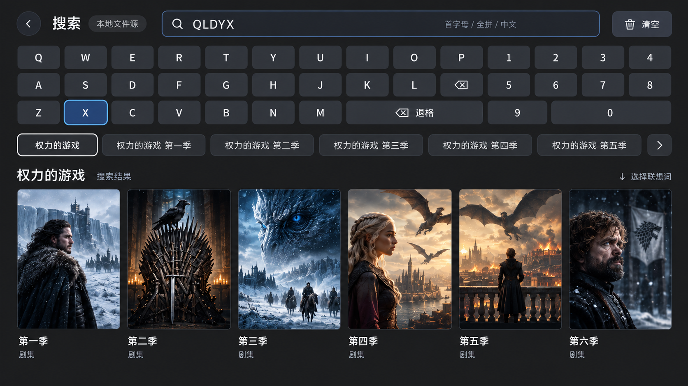

## Context

现有 SearchSession 提供超时与代次防护；SearchWorkspacePage 把补全直接绑定结果并在选择时覆盖输入。查询最多返回 200 项，按电影/剧集去重。本地范围仍为已配置 WebDAV/SMB 聚合。动机见 proposal.md。

## Goals / Non-Goals

**Goals:** 将输入、候选列表、选中片名及结果分离，复用查询和历史存储；压缩操作区的纵向空间，使候选靠近键盘并让结果在首屏完整可见。

**Non-Goals:** 不引入新的视觉主题、热搜或服务器联想接口；不改变服务器检索协议、结果分组与排序，不迁移数据库，不归档。

## Decisions

- 单字母仅放开 title_initials 前缀，保留全拼单字母限制和已有相关度层级，避免音节中段放大召回。
- 输入停止 250ms 后查询候选；沿用最多 200 条搜索结果与稳定排序，去重提取最多 20 个片名。选中后重新按片名查询，避免候选集合截断影响该词结果。候选不绑定二次搜索结果。
- 自动选中首项更新选中状态和结果，同时写入片名历史，不移动焦点、不改输入。显式点击或确认也写入片名；沿用数据库按来源与关键词去重。普通提交优先确认已选候选，无候选则沿用原搜索提交。
- 同一个 SearchSession 依次承载候选查询和片名查询，输入变化立即失效；在 accepted 后方可启动后续查询。重试保留所选片名。清空、换源及离页清除候选。
- 使用现有配色，键盘下放横向 List 胶囊词，白色边框表示选中，蓝色表示遥控器焦点。输入时隐藏本地历史，清空时恢复；首行结果向上回到所选联想词。

## Risks / Trade-offs

- 大库候选有界，可能不是所有片名 → 明确最多 20 项，不承诺全量；候选来源于真实搜索结果。
- 连续输入和两阶段查询可能乱序 → 复用代次保护并增加延迟响应回归。
- 主机测试不证明 TV 遥控器效果 → 执行可用构建并记录设备验证范围。

## Migration Plan

无需数据迁移；回滚代码即可恢复。保留变更目录，等待用户另行通知归档。

## 后续交互调整

历史区的清空按钮置于所有历史词之前，沿用现有样式、来源隔离与删除行为。

## 已确认的紧凑布局

采用第二版横向布局，取消第一版左右分栏和纵向候选方案。本节是最新布局依据（代码已实现，原生视觉验收见 tasks.md）；既有搜索匹配、自动首项历史和来源隔离规则继续生效。

效果图仅用于布局参考，海报为示意数据，不要求生成季列表或改变实际结果结构。图中的重复退格图标及位于结果区的“↓ 选择联想词”提示不作为实现要求：键盘保留一个清空动作和一个退格动作，避免误导性的重复入口；焦点提示如需保留应放在对应操作区。

### 本地文件源

- 一行顶部栏：返回、搜索标题、当前来源、输入框及清空输入按钮。来源名过长时截断，不撑成多行。
- 仅在输入框附近保留一处“首字母 / 全拼 / 中文”提示，移除单独的来源说明、示例段落和重复的空态操作说明。
- 顶部栏下为三行紧凑 QWERTY 键盘与独立数字区；保持可读、可聚焦的键尺寸，削减容器内外边距，不采用左侧六行键盘。
- 联想词紧贴键盘底行，使用整行横向滚动，常规长度片名以同时看到约 6 项为目标；按内容宽度和屏宽自适应，不通过缩小字体或截断所有标题强行凑数。长词设合理宽度上限，聚焦项应能读到完整标题；更多候选通过边缘提示和横向滚动访问。
- 键盘底行按一次下方向进入候选行；左右浏览，确认选择，上方向返回键盘，向下进入结果。候选未就绪或为空时使用历史/结果/输入的有效节点，不能请求不存在的焦点 ID。自动首项选择只改变选择态，不抢键盘焦点；首行结果向上返回所选候选。
- 空输入时同一横向词条位置显示历史，清空当前来源历史排第一；没有历史时不展示空容器。非空输入显示联想词，不额外堆叠历史。
- 参考 16:9 画面：顶部操作区约占上方 40%，结果使用剩余空间。首屏应完整容纳一排 6 张海报及标题、必要元数据；结果超过一排在结果区继续滚动。保持安全边距，不要求固定图像像素直接作为 vp。

### 影视服务器（Jellyfin / Emby / Plex）

- 同一行顶部栏展示返回、搜索、当前服务器名称及输入框，避免把来源说明单独占一行。
- 不渲染本地 QWERTY/数字键盘，不声明支持本地拼音规则。由用户主动确认/编辑输入框打开系统键盘，程序恢复焦点不主动弹键盘。
- 输入框附近用一句占位提示说明按片名检索；不保留独立长示例段落。
- 输入框下为当前实例的横向历史，清空当前来源历史排第一。无论是否输入，都不把本地候选混入该行；当前未接入服务器在线联想，因此不生成或承诺服务器片名补全。
- 确认历史词仅查询当前实例。系统键盘收起后不留下自定义键盘占位，结果区上移并利用剩余高度；键盘弹出时遵循系统避让。
- 沿用服务器检索、提交历史、结果数量上限、加载/错误/空态和详情身份验证；不因此次重排改变搜索时机。
- 输入、历史、结果之间遥控器可达；返回优先退出系统编辑，再沿用页面返回规则。切源立即清除旧输入、候选和结果，并重新建立有效焦点。

### 验收边界

本地以约 6 条常规长度候选和 6 张首排海报验证紧凑效果，同时检查超长片名、20 个候选、15 条历史及空列表。服务器检查系统键盘打开/关闭、长服务器名、不同实例历史隔离和无历史状态。重点检查目标 TV 的可读性及实际焦点路线，构建通过不等于视觉验收。

## 布局实现参数

页面使用填满可用高度的 Column，结果 Grid 独立滚动；顶部栏 48vp，键盘 3 × 36vp 加两段 8vp 间距，词条行 48vp，区块间距 12vp。移除页面外层纵向 Scroll 和独立来源/示例说明。结果卡宽取六列可用宽度与剩余高度折算宽度的较小值，预留标题、元数据及焦点边距；评分并入元数据行。

历史与联想词复用 SearchWordChip，18fp 字号、内容自适应宽度及最大宽度；长文本聚焦用 MARQUEE。历史删除仍为独立可聚焦按钮。键盘记录最后焦点，底行 DOWN 跳到选中词，词条 UP 返回键盘（服务器则返回输入），空列表按现有结果或输入回退。来源变化重置历史焦点索引。
